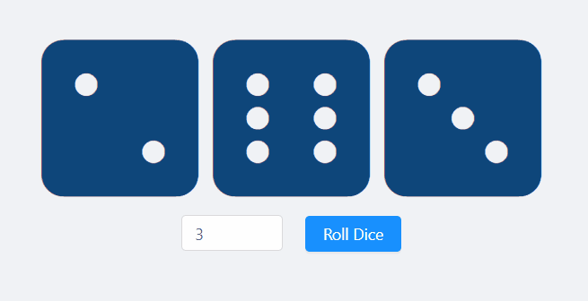

# react-dicey 🎲

A simple dice rolling component build with react. The project is mainly implemented using the _Hooks_ API and _antd_ design system.
  

  

  

## Install

    $ git clone https://github.com/Asifm95/react-dicey.git
    $ cd PROJECT
    $ npm install

## Start & watch

    $ npm start

Open [http://localhost:3000](http://localhost:3000) to view it in the browser.

## Simple build for production

    $ npm run build
